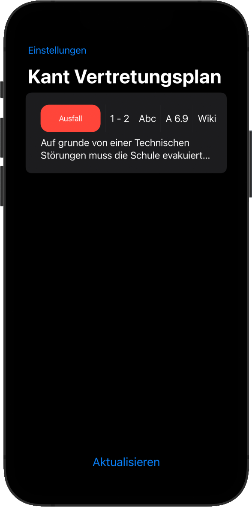
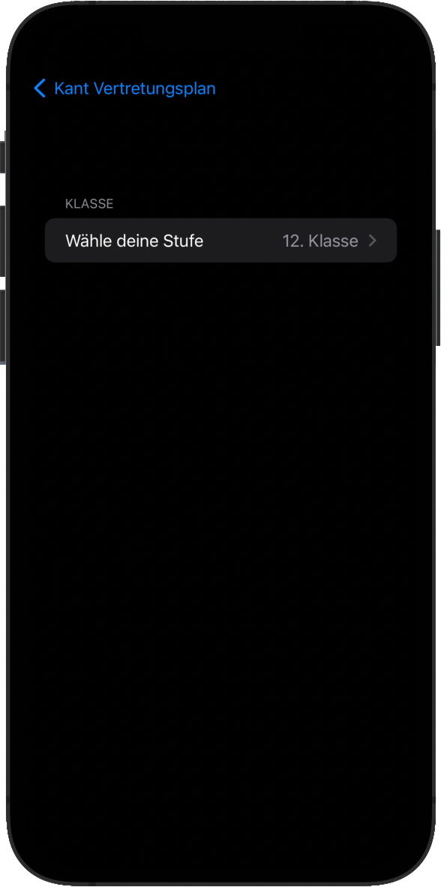

# Kant Vertretungs Plan App

To see if any classes are dismissed, we have to log on to the school board via a web browser and then navigate tediously to the current page. This is very annoying and time-consuming and caused me and some of my friend to actually drive to school even tho the class was dismissed, so i decided to make it a bit easier.

This app allows you to view the Substitution plan instantly without having to log in once.

<section>
  
   
</section>

## Approach

My first thought was that users of the app had to authenticate using the Oauth2 endpoint of our WordPress school board because to view the substitution plan we had to be logged in. But when looking at the HTML layout of the Substitution site, I noticed that the actual plan was embedded in an iframe that could be accessed without authentication. From there on, it was an easy development circle. Even though I had some experience developing swift / SwiftUI applications, I thought that some further education in this field would be beneficial. So I stumbled on a Stanford course on SwiftUI.

I watched lecture 1 throught 12 and can say that it made the development a hole lot easier. Thanke you Stanford for offering free recordings of your courses, please check them out.